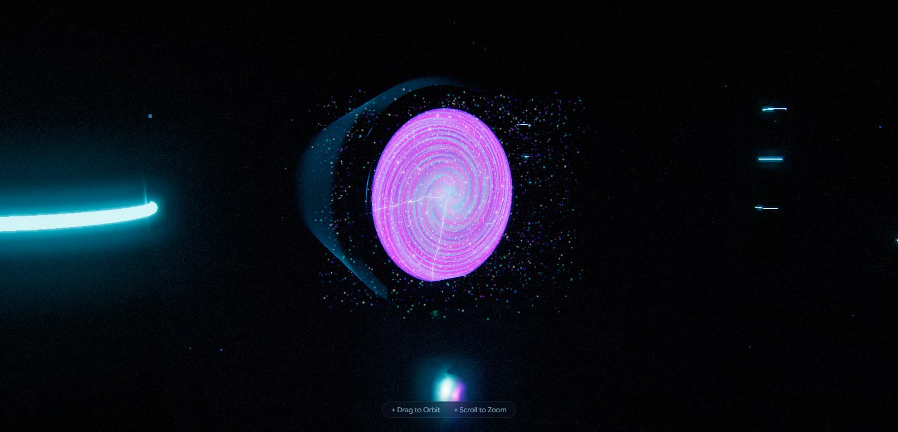

<p align="center">
  
</p>

# Singularity Portal 3D

> *Where mathematics becomes light, and light becomes an invitation to look beyond.*

An immersive WebGL experience built with Three.js. A dimensional portal materializes in a dark, industrial chamber — its surface driven entirely by procedural generation and real-time custom shaders. No pre-baked assets. No external models. Every texture, every glow, every particle is computed on the fly.

---


## Table of Contents

- [What You're Seeing](#what-youre-seeing)
- [Key Features](#key-features)
- [Architecture](#architecture)
- [Shader System](#shader-system)
- [Performance](#performance)
- [Getting Started](#getting-started)
- [Controls](#controls)
- [Project Structure](#project-structure)
- [Technologies](#technologies)
- [Known Limitations](#known-limitations)
- [Future Work](#future-work)
- [License](#license)

---

## What You're Seeing

At the center of the scene hovers a **rotating ring structure** — a mechanical frame with 12 emitter nodes that pulse with cyan light. Inside this frame, an **event horizon** unfolds: a vortex of swirling noise, layered colors, and a parallax starfield that creates the illusion of infinite depth.

Around it, **4,500 particles** orbit in spiraling trajectories, their colors blending between cyan, violet, and white. **Lightning arcs** crackle randomly across the portal's surface. A **volumetric light cone** projects outward, casting god rays into the fog.

The environment is a vast chamber with procedural tiled floors, metallic columns with glowing rings, and overhead beams — all lit by a carefully calibrated multi-light setup with real-time shadows.

---

## Key Features

| Feature | Description |
|---|---|
| **Procedural Texture Engine** | All floor, metal, and normal maps generated at runtime via FBM noise — zero external image files |
| **Custom Event Horizon Shader** | Vortex distortion, simplex noise layering, and parallax starfield create an interdimensional look |
| **Volumetric God Rays** | Cone-based shader with Fresnel rim lighting simulates atmospheric light scattering |
| **Dynamic Lightning Arcs** | Randomized 3D bolt geometry that regenerates every frame for organic plasma effects |
| **4,500 GPU Particles** | Custom point shader with size attenuation, distance fading, and additive blending |
| **600 Dust Motes** | Ambient floating particles filling the chamber with atmospheric depth |
| **Multi-Pass Post-Processing** | Unreal Bloom, cinematic vignette, chromatic aberration, and film grain |
| **Dynamic HDR Environment** | Procedurally generated PMREM environment map for accurate PBR reflections |
| **Physical Material System** | PBR workflow with clearcoat, metalness, roughness maps, and environment intensity control |
| **Futuristic Preloader** | Animated spinner with progress bar and cinematic blur transition into the scene |

---

## Architecture

The project is a single-page application with no build step. Everything runs directly in the browser through ES modules and an import map that resolves Three.js from a CDN.

```
Browser
 └── index.html
      ├── style.css          (UI, preloader, HUD overlay)
      └── main.js            (entire 3D scene, shaders, animation loop)
           ├── Renderer       (WebGL, tone mapping, shadow config)
           ├── Scene          (fog, environment, camera)
           ├── Textures       (procedural canvas generation)
           ├── Lights         (directional, point, ambient)
           ├── Room           (floor, ceiling, columns, beams)
           ├── Portal         (rings, nodes, cables, pedestal)
           ├── Shaders        (event horizon, volumetric, particles, cinematic)
           ├── Post-Processing (bloom, vignette, aberration, grain)
           └── Animation Loop (60fps orchestration of all systems)
```

---

## Shader System

The visual identity of this project lives in its shaders. Four custom GLSL programs run every frame:

### Event Horizon

The portal's surface is a `ShaderMaterial` applied to a double-sided circle. It uses:

- **Simplex noise** (3D, permutation-based) for organic turbulence
- **Spiral UV distortion** based on polar coordinates and time
- **Three-color gradient blending** that shifts between cyan, blue, and magenta
- **Core glow** and **rim fresnel** for depth and edge definition
- **Discard at radius** to maintain a perfect circular boundary

### Volumetric Light Cone

A cylindrical cone geometry with additive blending. The fragment shader computes:

- **View-dependent rim** lighting based on the dot product of view direction and normal
- **Vertical fade** using smoothstep to soften the cone's endpoints
- **Animated noise** along the UV to simulate shimmering atmospheric particles

### Particle System

4,500 points rendered with a custom `ShaderMaterial`. Each particle carries per-vertex attributes for size and color. The vertex shader applies distance-based attenuation, and the fragment shader creates a soft circular glow using `gl_PointCoord`.

### Cinematic Pass

A full-screen `ShaderPass` applied as the final stage:

- **Chromatic aberration** — offsets R, B channels radially from screen center
- **Vignette** — smooth darkening toward the edges
- **Film grain** — time-seeded pseudo-random noise for texture

---

## Performance

The scene is designed for **60fps on modern hardware**. Key optimizations:

- Pixel ratio is capped at `2` to prevent overdraw on high-DPI displays
- Shadow maps use `PCFSoftShadowMap` with bias tuning to avoid artifacts without oversampling
- Bloom threshold is set to `0.65` — only bright highlights trigger the blur pass
- Particle count is GPU-bound (point sprites), not geometry-bound
- All textures are generated once at load, then cached as `CanvasTexture`
- Fog uses `FogExp2` for exponential distance falloff, reducing the need for distant geometry detail
- `OutputPass` handles color space conversion in the post-processing chain

---

## Getting Started

**Prerequisites:** A modern browser with WebGL 2 support.

No build tools. No dependencies to install.

```bash
git clone https://github.com/your-username/singularity-portal-3d.git
cd singularity-portal-3d
```

Then serve the files with any local server:

```bash
# Python
python -m http.server 8000

# Node.js
npx serve .

# PHP
php -S localhost:8000
```

Open `http://localhost:8000` in your browser.

> **Note:** The scene must be served over HTTP(S), not opened as a local file, due to ES module import restrictions.

---

## Controls

| Input | Action |
|---|---|
| **Left click + drag** | Orbit the camera around the portal |
| **Scroll wheel** | Zoom in / out |
| **Touch + drag** | Orbit (mobile) |
| **Pinch** | Zoom (mobile) |

Camera movement includes **damping** for smooth, cinematic rotation. Pan is disabled to keep the focus on the portal.

---

## Project Structure

```
portal/
├── index.html          Entry point — canvas, loading screen, HUD
├── main.js             Scene, shaders, materials, animation loop
├── style.css           UI styling, preloader, glassmorphic HUD
├── img/
│   └── preview.jpg     Project preview image
└── README.md           This file
```

---

## Technologies

| Layer | Technology |
|---|---|
| **3D Engine** | [Three.js](https://threejs.org/) v0.164.1 |
| **Shaders** | Custom GLSL (vertex + fragment) |
| **Post-Processing** | EffectComposer, UnrealBloomPass, ShaderPass |
| **Orbit Controls** | Three.js OrbitControls addon |
| **PBR Rendering** | MeshPhysicalMaterial with clearcoat |
| **HDR Generation** | PMREMGenerator (procedural) |
| **Typography** | Google Sans Flex |
| **Hosting** | Static files — any HTTP server |

---

## Known Limitations

- **No mobile-optimized touch gestures** — pinch-to-zoom may feel coarse on small screens
- **Procedural textures are generated sequentially** — load time scales with texture resolution
- **No WebGPU fallback** — requires WebGL 2; older devices will fall back to WebGL 1 with reduced features
- **Single scene** — no navigation, no scenes, no transitions

---

## Future Work

- [ ] **Audio reactivity** — portal pulsation synced to frequency analysis
- [ ] **User-driven color tuning** — GUI controls for portal color palette
- [ ] **Multiple portal configurations** — different geometries, noise algorithms, particle behaviors
- [ ] **WebGPU renderer** — next-gen rendering path for supported browsers
- [ ] **VR support** — WebXR integration for immersive viewing
- [ ] **Scene presets** — saved camera positions and lighting configurations

---

<div align="center">

Made with ❤️ by <a href="https://sebas-dev.vercel.app/" target="_blank" rel="noopener noreferrer">Sebastián V</a>

</div>